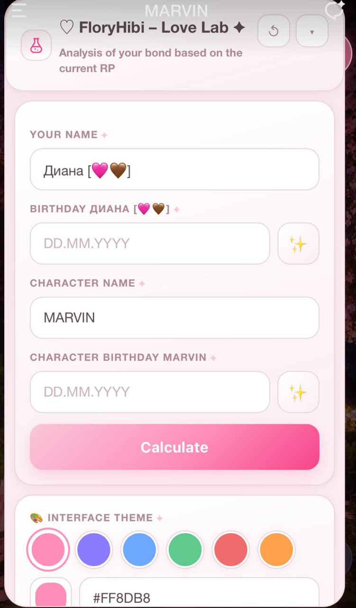
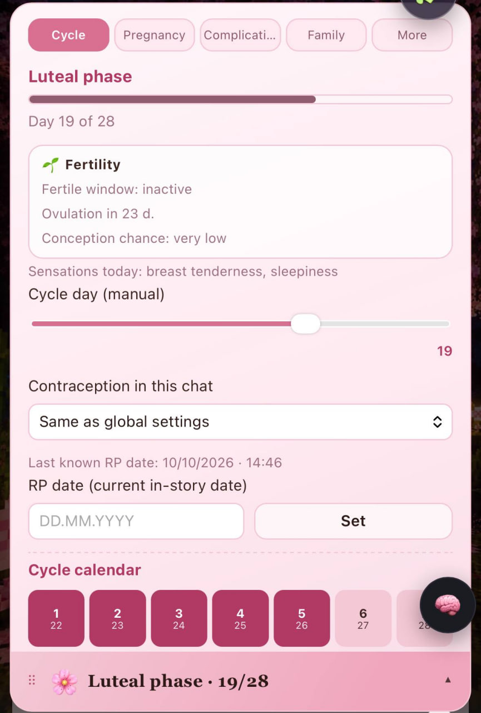
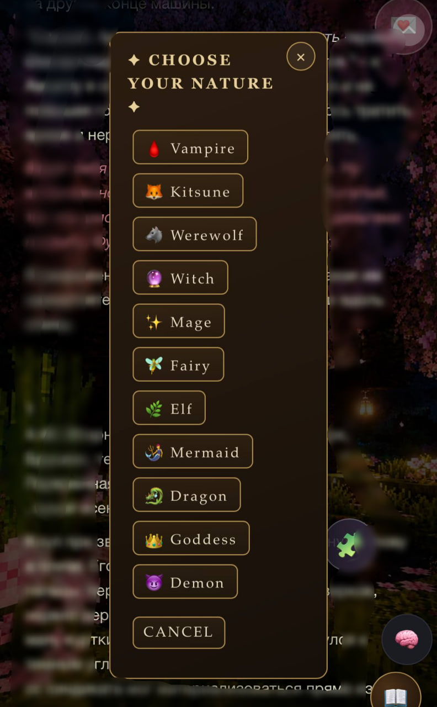

# 🧩 TavoAi Plugins by @floryhibi

> Six modular plugins for **TavoAi** — relationships, biology, supernatural lore, character dossiers, estates and an AI companion watching your RP.

All plugins are bilingual **EN/RU** — the interface follows your TavoAi language automatically.

---

## 💘 Love Lab — Compatibility Laboratory

Analyses the bond between you and the character based on the current RP: zodiac compatibility, natal hints, relationship dynamics. Birth dates are found from the card/lore or generated by the model.

## 🤰 Reproductive System

Full cycle simulation synced with the in-story date: cycle calendar, phases, ovulation tracking, contraception, pregnancy and genetics. The RP date is detected from the text automatically.

## 👁 Observer

A meta-companion that watches your RP from the sidelines and reacts — emotional friend, snarky bestie or a detective hunting for plot contradictions. Runs on your own OpenAI-compatible API, never writes to chat history.

## 🦇 Supernatural Codex

A living book of supernatural natures: vampire, kitsune, werewolf, witch, mage, fairy, elf, mermaid, dragon, goddess, demon — plus custom species. Scans the character card, tracks resource, mastery, abilities, lineage, weaknesses and chronicle.

## 🎨 Facets

Dossier generator: 26 topics of character tastes and traits (food, music, fears, habits…) rendered as a beautiful floating card panel.

## 🏠 Estate

Household and property system for your RP: homes, rooms, states and everything your characters own — visualized in one panel.

---

## ⬇️ Install

1. Download the `.tpg` files from the [**Releases**](https://github.com/floryhibi/Tavo_Plugins_by-floryhibi/releases/tag/v1.0) page (Assets).
2. TavoAi → **Plugins** → import each `.tpg`.
3. Open the plugin panel and adjust settings — each plugin stores data per chat.

## 🔗 Links

- 🌸 **PeonySet preset** — https://github.com/floryhibi/Tavo_PeonySet_by-floryhibi
- 🏠 **Tavo Hub** — https://hub.tavoai.dev/creators/HQ4G1
- ☕ **Support me (Boosty)** — https://boosty.to/floryhibi
- 🌐 **Website** — https://floryhibi.ru

## 📜 License

[CC BY-NC 4.0](https://creativecommons.org/licenses/by-nc/4.0/) — share and adapt with credit, no commercial use.

---

made with 🌸 by <b>@floryhibi</b> 

